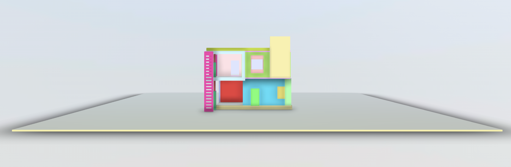

# 🏡 Residential Design Project - Autodesk 3ds Max

Welcome to the **Residential Design Project** repository! This project showcases a detailed and realistic 3D model for a house residency, created with **Autodesk 3ds Max**. Leveraging powerful design techniques and meticulous attention to detail, this model brings architectural concepts to life for residential spaces.

---

## 🌟 Features

- **High-Quality 3D Modeling**: Precision in every element, from layout to intricate details, ensuring an authentic and practical design representation.
- **Realistic Rendering**: Achieved through advanced materials, textures, and lighting for a visually immersive experience.
- **Comprehensive Layout**: Thoughtfully designed to meet residential standards, combining functionality with aesthetics.

---

## 🛠️ Tools & Technologies

- **Autodesk 3ds Max**: Used for creating and refining the 3D model with precision.
- **V-Ray** *(optional)*: For added realism in rendering, providing photorealistic lighting and materials.

---

## 📂 Project Structure

- **Models**: Contains all 3D assets, organized by room and element type.
- **Textures**: High-resolution textures used in the design for added detail.
- **Renders**: Final rendered images showcasing different views and lighting scenarios.

---

## 🔍 Preview
**File_1**

**Image File**

**OR Visit for Full View**

https://autode.sk/3NUvgPu

**File_2**

**Image File**

**OR Visit for Full View**

https://autode.sk/3UD0jDg

**File_3**

**Image File**

**OR Visit for Full View**

https://autode.sk/3AtBq5R

**File_4**

**Image File**

**OR Visit for Full View**

https://autode.sk/3UD0oH4

**File_5**

**Image File**

**OR Visit for Full View**

https://autode.sk/48A4LbA

**File_6**

**Image File**

**OR Visit for Full View**

https://autode.sk/3YCcYqT

**File_7**

**Image File**

**OR Visit for Full View**

https://autode.sk/48xLBTL

**File_8**

**Image File**

**OR Visit for Full View**

https://autode.sk/48EyCQg

**File_9**

**Image File**

**OR Visit for Full View**

https://autode.sk/3Ci7ryA

**File_10**

**Image File**

**OR Visit for Full View**

https://autode.sk/3NQLlpk

**File_11**

**Image File**

**OR Visit for Full View**

https://autode.sk/3AB1sUM

**File_12**

**Image File**

**OR Visit for Full View**

https://autode.sk/3CcLHEh

---

## 🚀 Getting Started

1. Clone the repository.
2. Open the project files in **Autodesk 3ds Max**.
3. (Optional) Enable **V-Ray** settings if rendering with V-Ray.

**OR Download This Project and Open file in Autodesk**

---

## 📄 License

This project is licensed under the MIT License.

---

Thank you for visiting this repository!
